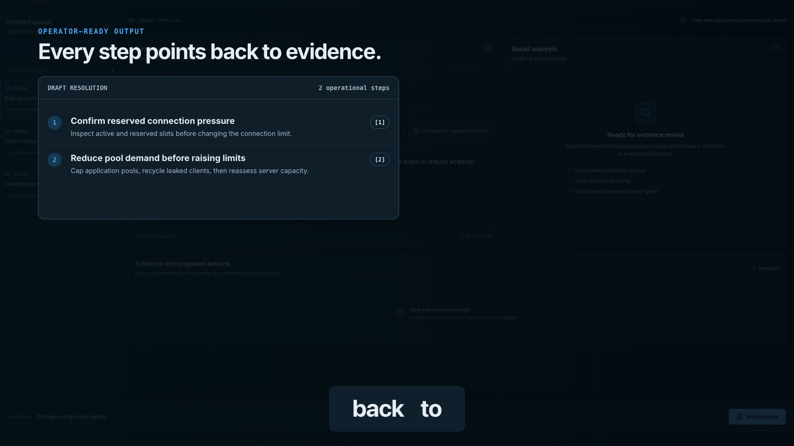
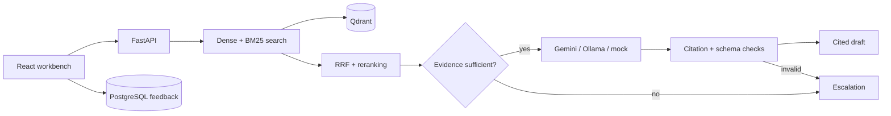

# Recall

Recall is a support workbench for PostgreSQL and pgvector incidents. Give it a case and it searches a small, pinned knowledge base, reranks the best passages, and returns either a cited response or a clear escalation.


> Recall is a local project. It has not been deployed publicly or tested with real customer tickets.

## Walkthrough

[](docs/walkthrough/recall-walkthrough.mp4)

The walkthrough is 59.7 seconds long and shows the actual local application. A [transcript](docs/walkthrough/SCRIPT.md) and [WebVTT captions](docs/walkthrough/recall-walkthrough.vtt) are included in the repository.

## How it works

1. Recall searches dense and BM25 indexes for matching passages.
2. Reciprocal-rank fusion combines the two result sets.
3. A cross-encoder reranks the strongest candidates.
4. At most five passages from varied sources are sent to the selected generator.
5. The response is checked for structure and valid citations.
6. Weak, missing, or conflicting evidence produces an escalation instead of a guess.



Submitted case text is used for one request and is not written to PostgreSQL, Qdrant, or application logs. With Gemini enabled, the case and selected evidence are sent to Gemini for generation. See [data and privacy boundaries](docs/DATA_BOUNDARIES.md) for the full details.

## Run locally

You need Docker with Compose v2 and a Gemini API key. The first build downloads the embedding and reranking models, so it takes longer than later starts.

```bash
git clone https://github.com/SaiDheerajPeketi/Recall.git
cd Recall
export GEMINI_API_KEY="your-key"
docker compose up --build
```

Once the services are healthy:

- Workbench: <http://localhost:3000>
- API docs: <http://localhost:8000/docs>
- Health check: <http://localhost:8000/api/v1/health>

The bootstrap job is idempotent. If the source files have not changed, it reuses the existing index.

### Run without Gemini

The deterministic mock provider is useful for development and tests:

```bash
GENERATION_PROVIDER=mock docker compose up --build
```

To use Ollama running on macOS:

```bash
ollama pull qwen3:4b
GENERATION_PROVIDER=ollama \
OLLAMA_BASE_URL=http://host.docker.internal:11434 \
docker compose up --build
```

The containerized Ollama profile is also available. Give Docker at least 4 GiB of memory before loading `qwen3:4b`.

```bash
docker compose --profile ollama up -d ollama
docker compose exec ollama ollama pull qwen3:4b
GENERATION_PROVIDER=ollama \
OLLAMA_BASE_URL=http://ollama:11434 \
docker compose --profile ollama up --build
```

## API

| Method | Route | What it does |
| --- | --- | --- |
| `POST` | `/api/v1/tickets/analyze` | Returns a cited draft or escalation |
| `POST` | `/api/v1/feedback` | Stores feedback against an opaque analysis ID |
| `GET` | `/api/v1/demo-tickets` | Returns safe example cases |
| `GET` | `/api/v1/health` | Checks the API, database, vector store, corpus, and provider |

The frontend types are generated from the FastAPI OpenAPI document:

```bash
cd frontend
npm ci
npm run generate:types
```

## Evaluation

The benchmark has 20 development cases for threshold tuning and 60 held-out test cases. The cases cover known answers, ambiguous requests, irrelevant requests, conflicting evidence, missing diagnostics, and prompt injection.

| Test-set measure | Result |
| --- | ---: |
| Precision@5 | 0.2923 |
| Recall@5 | 0.9904 |
| MRR | 0.9119 |
| Citation coverage | 100% |
| Escalation accuracy | 95% |
| Unsupported-case escalation recall | 100% |
| Warm end-to-end latency | 2,050 ms p50 / 2,216 ms p95 |

These results were recorded on May 31, 2026 with Gemini 3.5 Flash-Lite and a threshold of 0.55 chosen on the development split. The cases and labels were written for this project, and the citation check is automated; the results are not a substitute for an independent review or a user pilot.

See the [evaluation report](evaluation/REPORT.md) for the full results and [evaluation guide](evaluation/README.md) for reproduction commands.

## Tests

```bash
# Backend
docker compose run --rm evaluator pytest -q

# Frontend
cd frontend
npm ci
npm test
npm run build

# Browser tests (the web app must be running on port 3000)
npm run test:e2e
```

The last local validation passed 25 backend tests, five frontend tests, two Playwright workflows, image builds, health checks, idempotent indexing, and a live Gemini-backed analysis.

## Project layout

```text
frontend/    React and Vite workbench
backend/     FastAPI service, retrieval, generation, and tests
data/        source manifest and support notes
evaluation/  benchmark cases, runner, report, and raw results
docs/        product, design, privacy, and walkthrough notes
deploy/      optional single-host deployment overlay
```

Useful background:

- [Product scope](docs/PRODUCT.md)
- [Design notes](docs/DESIGN.md)
- [Data and privacy boundaries](docs/DATA_BOUNDARIES.md)
- [Technical decisions](docs/DECISIONS.md)
- [Corpus provenance](data/README.md)

## Known limits

- The knowledge base is intentionally small and limited to PostgreSQL and pgvector.
- The benchmark is synthetic and project-authored.
- There is no authentication, tenant isolation, audit policy, or public deployment.
- Feedback is local and has not been reviewed by support engineers.
- Provider latency and quotas vary by account and region.

The optional [deployment overlay](deploy/README.md) is a starting point for a single Docker host. Authentication, monitoring, backups, secrets management, and DNS still need to be designed for the target environment.

To stop the stack while keeping local data:

```bash
docker compose down
```

To remove all local data and rebuild from scratch:

```bash
docker compose down -v
```

The second command permanently deletes the local PostgreSQL, Qdrant, Ollama, and model-cache volumes.
