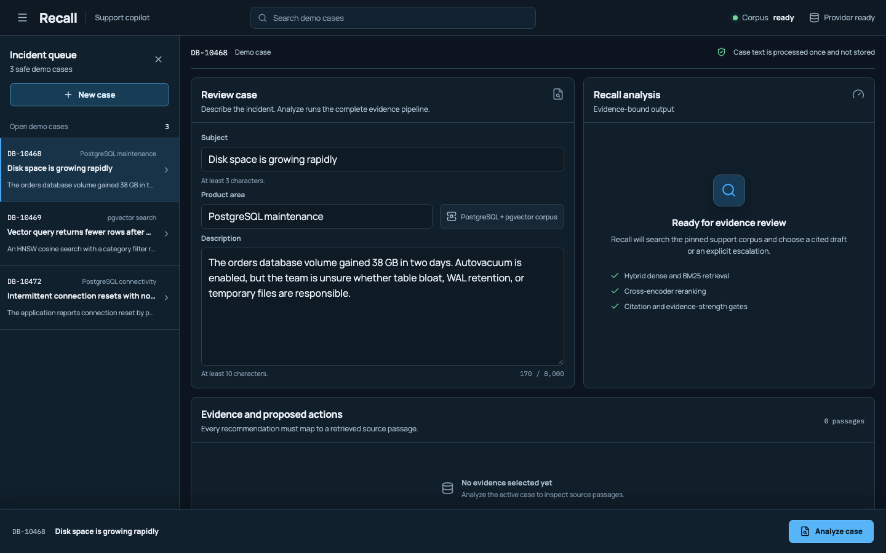
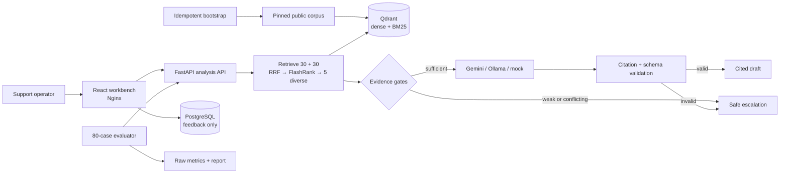

# Recall

Recall is a support copilot for PostgreSQL and pgvector incidents. An operator submits a case, Recall retrieves and reranks a pinned public support corpus, then returns either a cited resolution draft or an explicit escalation when the evidence is weak, missing, or conflicting.



> **Current status:** Docker-ready and validated locally. Recall is not publicly hosted, has not run a user pilot, and makes no measured time-saved claim.

## What it does

- Runs each New case through dense and BM25 retrieval, reciprocal-rank fusion, and cross-encoder reranking.
- Gives generation at most five diverse evidence passages.
- Requires every actionable step to cite a retrieved chunk.
- Escalates instead of guessing when evidence is incomplete, citations fail validation, structured output is malformed, or a dependency fails.
- Stores explicit feedback in PostgreSQL without storing the submitted subject or description.
- Supports Gemini, Ollama, and a deterministic mock provider behind the same interface.

## Architecture



The browser never receives provider credentials. Ticket text is processed for one request, excluded from application logs, and not written to PostgreSQL or the evaluation result files.

## Local setup

### Requirements

- Docker Desktop or Docker Engine with Compose v2.
- An internet connection on the first build so the images and pinned retrieval models can download.
- A Gemini API key for the default provider. Ollama and mock alternatives are documented below.

### Start Recall with Gemini

Keep the key in your shell or secret manager; do not put it in a committed file.

```bash
git clone https://github.com/SaiDheerajPeketi/Recall.git
cd Recall
export GEMINI_API_KEY="your-key"
docker compose up --build
```

`GOOGLE_API_KEY` is accepted as a compatibility alias. When startup finishes:

- Workbench: <http://localhost:3000>
- API docs: <http://localhost:8000/docs>
- Health: <http://localhost:8000/api/v1/health>

The first start is slower because bootstrap downloads the BGE embedding model and FlashRank reranker, creates the database schema, and indexes the corpus. Bootstrap is idempotent, so later starts reuse unchanged content.

Check readiness:

```bash
curl -fsS http://localhost:8000/api/v1/health
```

The response is ready only when the API, PostgreSQL, Qdrant, corpus, and selected provider are all available.

## Provider switching

Gemini 3.5 Flash-Lite is the validated default. The originally planned 2.5 Flash-Lite identifier returned a provider migration error for a new account, so the model remains configurable rather than hard-coded into the interface.

### Deterministic mock

Useful for offline development and provider-independent tests:

```bash
GENERATION_PROVIDER=mock docker compose up --build
```

### Native Ollama on macOS

Run Ollama on the host, pull the model, then point the API at Docker's host bridge:

```bash
ollama pull qwen3:4b
GENERATION_PROVIDER=ollama \
OLLAMA_BASE_URL=http://host.docker.internal:11434 \
docker compose up --build
```

### Containerized Ollama

Allocate at least 4 GiB to the Docker VM for `qwen3:4b`.

```bash
docker compose --profile ollama up -d ollama
docker compose exec ollama ollama pull qwen3:4b
GENERATION_PROVIDER=ollama \
OLLAMA_BASE_URL=http://ollama:11434 \
docker compose --profile ollama up --build
```

## API

| Method | Route | Purpose |
| --- | --- | --- |
| `POST` | `/api/v1/tickets/analyze` | Retrieve evidence and return a cited draft or escalation |
| `POST` | `/api/v1/feedback` | Store helpfulness, acceptance, optional correction/comment, and an optional human estimate of minutes saved |
| `GET` | `/api/v1/demo-tickets` | Return three safe database-support examples |
| `GET` | `/api/v1/health` | Report API, PostgreSQL, Qdrant, corpus, and provider readiness |

The frontend's TypeScript contract is generated from FastAPI's OpenAPI document:

```bash
cd frontend
npm ci
npm run generate:types
```

## Evaluation

The benchmark contains 20 development cases for threshold selection and 60 locked test cases. Cases cover known answers, ambiguity, irrelevant requests, contradictions, missing diagnostic evidence, and prompt injection.

| Locked-test measure | Result |
| --- | ---: |
| Precision@5 | 0.2923 |
| Recall@5 | 0.9904 |
| MRR | 0.9119 |
| Claim-level faithfulness | 100% across 97 generated claims |
| Citation coverage | 100% |
| Escalation accuracy | 95% |
| Escalation precision / recall / F1 | 80% / 100% / 88.89% |
| Gemini provider success | 49 / 49 attempted case requests |
| Warm end-to-end latency | 2,050 ms p50 / 2,216 ms p95 over 30 requests |

These numbers come from Gemini 3.5 Flash-Lite on 2026-09-16 with a 0.55 threshold selected only on the development split. Three supported test cases were conservatively escalated; no unsupported test case was drafted. The automated faithfulness measure validates citation identity and semantic support, not human adjudication.

The tested Docker VM did not have enough memory for a valid Ollama comparison: it exposed 1.9 GiB and `qwen3:4b` required 3.3 GiB. The failed request escalated safely, and no Ollama quality or latency number is claimed.

Read the [evaluation report](evaluation/REPORT.md), [method and commands](evaluation/README.md), or inspect the committed raw measurements in `evaluation/results/`.

Reproduce the locked run:

```bash
docker compose run --rm evaluator python -m app.evaluation \
  --split test --provider gemini --request-delay-ms 2500 --latency-runs 30 \
  --output /app/evaluation/results/test-gemini-controlled.json
```

The delay happens between requests and is excluded from the latency samples.

## Tests

```bash
# Backend: unit, safety, outage, OpenAPI, and evaluation checks
docker compose run --rm evaluator pytest -q

# Frontend: component and automated accessibility checks
cd frontend
npm ci
npm test
npm run build

# Desktop and mobile New case workflows; expects the local web container on port 3000
npm run test:e2e
```

The validated local run passed 25 backend tests, five frontend tests including an axe scan, two Playwright viewport workflows, production image builds, service health checks, idempotent indexing, and a real Gemini-backed ticket analysis.

## Corpus provenance

The repository pins four PostgreSQL documentation extracts, two pgvector documentation extracts, and two original support notes paraphrased from resolved public pgvector issues. `data/sources.json` records each source URL, license, retrieval date, local path, and SHA-256 content hash. Generated chunks are excluded from Git and are rebuilt from those files.

The corpus is intentionally narrow. Recall should not be treated as a general database authority or used to execute changes without operator review.

## Troubleshooting

- **Health says `provider: not_configured`:** export the Gemini key in the same shell that launches Compose, or select `GENERATION_PROVIDER=mock`.
- **Gemini requests escalate during a burst:** the free or project quota may be rate-limiting requests. The evaluator supports `--request-delay-ms`; production deployment needs explicit request throttling and quota monitoring.
- **Ollama returns a memory error:** give Docker at least 4 GiB or run Ollama natively. Do not treat a failed load as a quality result.
- **Corpus is not ready:** inspect `docker compose logs bootstrap qdrant`, then rerun `docker compose run --rm bootstrap`. Rebuilding is safe and idempotent.
- **Ports are already in use:** change the host-side `3000`, `8000`, `5432`, `6333`, or `11434` mappings in a local override.

To stop the stack while keeping indexed data and feedback:

```bash
docker compose down
```

To delete all local PostgreSQL, Qdrant, Ollama, and model-cache volumes and rebuild from scratch:

```bash
docker compose down -v
```

That second command permanently removes local Recall data.

## Repository map

```text
frontend/    React/Vite incident workbench
backend/     FastAPI, retrieval, generation, safety gates, and tests
data/        pinned source manifest and public source extracts
evaluation/  80 cases, evaluator, report, and raw measurements
docs/        product boundaries, interface, design, and decision log
deploy/      deployment assets and future cloud overlay
```

Every consequential product or engineering choice is recorded in [docs/DECISIONS.md](docs/DECISIONS.md), including alternatives, evidence, consequences, and revisit conditions.

## Limitations and deployment status

- No public live demo is deployed yet.
- No authentication, tenant isolation, SSO, audit-retention policy, or compliance review is included.
- Feedback is local and has not been reviewed by pilot users.
- The evaluation set is project-authored rather than independently labeled.
- Provider availability and latency vary by quota, region, and time.

The application is prepared for local validation today. Production secrets, infrastructure, access controls, monitoring, backups, and a public domain remain deployment work for the repository owner.
